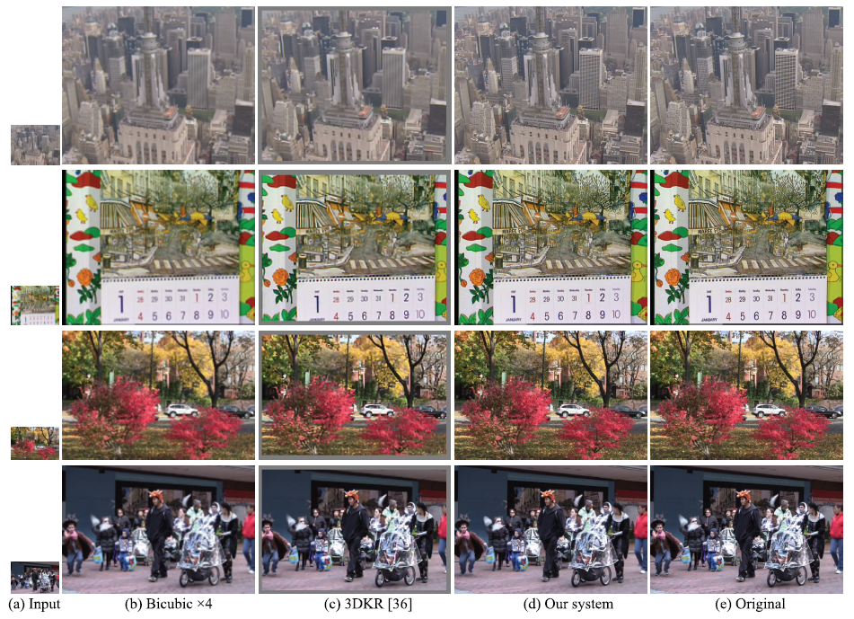

# The Datasets of Deep Video Super-Resolution

To train a VSR model with open datasets, we have to generate the corresponding LR frame for each HR input frame by performing down-sampling using bicubic interpolation.

Generally, the scale of down-sampling set to x2, x3, and x4.

---

## 1) Vid4

---

The Vid4 dataset[1] is generally used for testing. It consists of the four sequences, walk (740x480, 47 frames), foliage (740x480, 49 frames), city (704x576, 34 frames), and calendar (720x576, 41 frames).

You can get the ground-truth (GT) of Vid4 dataset from [here][vid4link].

[vid4link]: https://drive.google.com/drive/folders/1An6hF1oYkeWxfOBxxKm073mvgIFrBNDA

---

## 2) Vimeo90K

---

The Vimeo90K[2] is a large-scale, high-quality video dataset, designed for the following four video processing tasks: temporal frame interpolation, video denoising, video deblocking, and video super-resolution.

**Septuplet dataset for super-resolution**

The septuplet dataset consists of 91701 7-frame sequences with fixed resolution 448x256, extracted from 39k selected video clips from Vimeo-90k.

The test set for video super-resolution: [zip (6GB)][vimeo90k-testlink].

The original training + test set (consists of 91701 sequences, which are not downsampled or downgraded by noise, it means this is the GT): [zip (82GB)][vimeo90k-alllink].

[vimeo90k-testlink]: http://data.csail.mit.edu/tofu/testset/vimeo_super_resolution_test.zip
[vimeo90k-alllink]: http://data.csail.mit.edu/tofu/dataset/vimeo_septuplet.zip
---

## 3) REDS

---

The REDS (REalistic and Dynamic Scenes) dataset[3] which proposed in the NTIRE 2019 challenge designed for two video processing tasks: video deblurring and video super resolution. All of the sequences have 720x 1280 resolution.

The GT and LR of REDS dataset for VSR can download from [the official website][redslink].

For VSR task, you need to download the 'Sharp' type for GT and 'Low Resolution' type for LR.

[redslink]: https://seungjunnah.github.io/Datasets/reds.html

---

## Citation

---

[1] C. Liu and D. Sun, “On bayesian adaptive video super resolution,” IEEE transactions on pattern analysis and machine intelligence, vol. 36, no. 2, pp. 346—-360, 2013.

[2] T. Xue, B. Chen, J. Wu, D. Wei, and W. T. Freeman, “Video enhancement with task-oriented flow,” arXiv preprint arXiv:1711.09078, 2017.

[3] Nah, Seungjun, et al. "Ntire 2019 challenge on video deblurring and super-resolution: Dataset and study." Proceedings of the IEEE Conference on Computer Vision and Pattern Recognition Workshops. 2019.
