# Deep Video Super-Resolution

---

## 1) The state-of-the-art VSR

---

Based on [paperwithcode VSR task](https://paperswithcode.com/task/video-super-resolution), this repository contains summary of the state-of-the-art VSR methods.

### The state-of-the-art VSR

| Model             | Published                                                                                                                                                                             | Code                                             | Year | Vid4 Y - 4x (PSNR) |
| ------------------ | ------------------------------------------------------------------------------------------------------------------------------------------------------------------------------------- | ------------------------------------------------ | ---- | ------------------ |
| VRT              | [arXiv][VRTpaperlink]                                                                                                                                                  | [PyTorch][VRTcodelink]                                                | 2022 | 27.93              |
| RRN-L              | [arXiv][RRN-Lpaperlink]                                                                                                                                                  | [PyTorch][RRN-Lcodelink]                                                | 2020 | 27.69              |
| iSeeBetter         | [Computational Visual Media][iSeeBetterpaperlink]                                                                                                                 | [PyTorch][iSeeBettercodelink]         | 2020 | 27.43              |
| PFNL               | [ICCV19][PFNLpaperlink] | [TensorFlow][PFNLcodelink]                | 2019 | 27.40              |
| ADNLVSR            | [Neurocomputing][ADNLVSRpaperlink]          | -                                                | 2020 | 27.39              |
| EDVR               | [CVPR19][EDVRpaperlink]                        | [PyTorch][EDVRcodelink]                  | 2019 | 27.35              |
| VSR-DUF            | [CVPR18][VSR-DUFpaperlink]                                                                             | [TensorFlow][VSR-DUFcodelink]                | 2018 | 27.31              |
| RBPN/6-PF          | [CVPR19][RBPN/6-PFpaperlink]                                         | [PyTorch][RBPN/6-PFcodelink]        | 2019 | 27.12              |
| TDAN               | [CVPR20][TDANpaperlink]                               | [PyTorch][TDANcodelink] | 2020 | 26.86              |
| FRVSR              | [CVPR18][FRVSRpaperlink]                                                             | -                                                | 2018 | 26.69              |
| WDVR               | [CVPR19][WDVRpaperlink]          | [PyTorch][WDVRcodelink]         | 2019 | 26.62              |
| MDCN               | [Neurocomputing][MDCNpaperlink]          | -                                                | 2019 | 26.49              |
| DDAN               | [IEEE Transactions on Image Processing][DDANpaperlink]                                                                                                                          | -                                                | 2020 | 26.48              |
| SOF-VSR            | [IEEE Transactions on Image Processing][SOF-VSRpaperlink]                                                                                                                          | [PyTorch][SOF-VSRcodelink]         | 2020 | 26.01              |
| DRDVSR             | [ICCV17][DRDVSRpaperlink]                                                                            | [TensorFlow][DRDVSRcodelink]        | 2017 | 25.88              |
| VESPCN             | [CVPR17][VESPCNpaperlink]                                                                 | -                                                | 2017 | 25.35              |
| Bicubic (Baseline) |                                                                                                                                                                                       |                                                  |      | 23.82              |
 
[VRTpaperlink]: https://arxiv.org/pdf/2201.12288v1.pdf
[RRN-Lpaperlink]: https://arxiv.org/pdf/2008.05765.pdf
[iSeeBetterpaperlink]: https://link.springer.com/content/pdf/10.1007/s41095-020-0175-7.pdf
[PFNLpaperlink]: https://openaccess.thecvf.com/content_ICCV_2019/papers/Yi_Progressive_Fusion_Video_Super-Resolution_Network_via_Exploiting_Non-Local_Spatio-Temporal_Correlations_ICCV_2019_paper.pdf
[ADNLVSRpaperlink]: https://www.sciencedirect.com/science/article/pii/S0925231220304550?casa_token=X22LpXpzhPQAAAAA:Zznqj2wrN_7UKydKmmFXYxSCx-K218Xr_9lnUh_yeMLrEexLxoH3B9QSDwSbAXYuwZs_qXpIA1Ym
[EDVRpaperlink]: https://openaccess.thecvf.com/content_CVPRW_2019/papers/NTIRE/Wang_EDVR_Video_Restoration_With_Enhanced_Deformable_Convolutional_Networks_CVPRW_2019_paper.pdf
[VSR-DUFpaperlink]: https://openaccess.thecvf.com/content_cvpr_2018/papers/Jo_Deep_Video_Super-Resolution_CVPR_2018_paper.pdf
[RBPN/6-PFpaperlink]: https://openaccess.thecvf.com/content_CVPR_2019/papers/Haris_Recurrent_Back-Projection_Network_for_Video_Super-Resolution_CVPR_2019_paper.pdf
[TDANpaperlink]: https://openaccess.thecvf.com/content_CVPR_2020/papers/Tian_TDAN_Temporally-Deformable_Alignment_Network_for_Video_Super-Resolution_CVPR_2020_paper.pdf
[FRVSRpaperlink]: https://openaccess.thecvf.com/content_cvpr_2018/papers/Sajjadi_Frame-Recurrent_Video_Super-Resolution_CVPR_2018_paper.pdf
[WDVRpaperlink]: https://openaccess.thecvf.com/content_CVPRW_2019/papers/NTIRE/Fan_An_Empirical_Investigation_of_Efficient_Spatio-Temporal_Modeling_in_Video_Restoration_CVPRW_2019_paper.pdf
[MDCNpaperlink]: https://www.sciencedirect.com/science/article/abs/pii/S0925231219314614
[DDANpaperlink]: https://ieeexplore.ieee.org/stamp/stamp.jsp?arnumber=8995790
[SOF-VSRpaperlink]: https://ieeexplore.ieee.org/stamp/stamp.jsp?arnumber=8967249
[DRDVSRpaperlink]: https://openaccess.thecvf.com/content_ICCV_2017/papers/Tao_Detail-Revealing_Deep_Video_ICCV_2017_paper.pdf
[VESPCNpaperlink]: https://openaccess.thecvf.com/content_cvpr_2017/papers/Caballero_Real-Time_Video_Super-Resolution_CVPR_2017_paper.pdf

[VRTcodelink]: https://github.com/jingyunliang/vrt
[RRN-Lcodelink]: https://github.com/junpan19/RRN
[iSeeBettercodelink]: https://github.com/amanchadha/iSeeBetter
[PFNLcodelink]: https://github.com/psychopa4/PFNL
[EDVRcodelink]: https://github.com/xinntao/EDVR
[VSR-DUFcodelink]: https://github.com/yhjo09/VSR-DUF
[RBPN/6-PFcodelink]: https://github.com/alterzero/RBPN-PyTorch
[TDANcodelink]: https://github.com/YapengTian/TDAN-VSR-CVPR-2020
[WDVRcodelink]: https://github.com/ychfan/wdvr_ntire2019
[SOF-VSRcodelink]: https://github.com/LongguangWang/SOF-VSR
[DRDVSRcodelink]: https://github.com/jiangsutx/SPMC_VideoSR

- **VRT**

  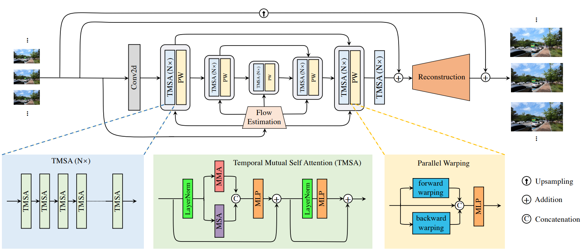

- **RRN-L**

  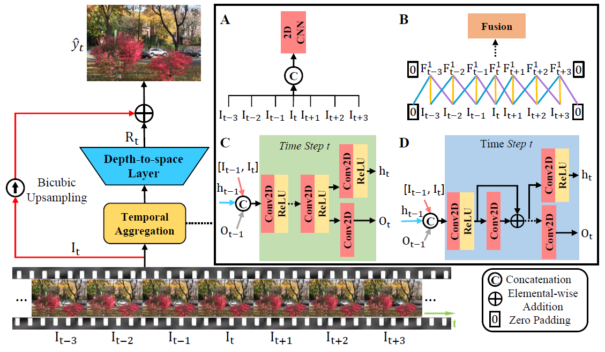

- **iSeeBetter**

  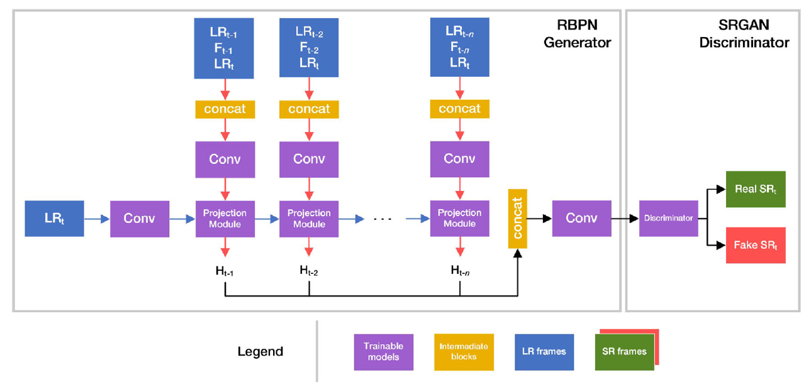

- **PFNL**

  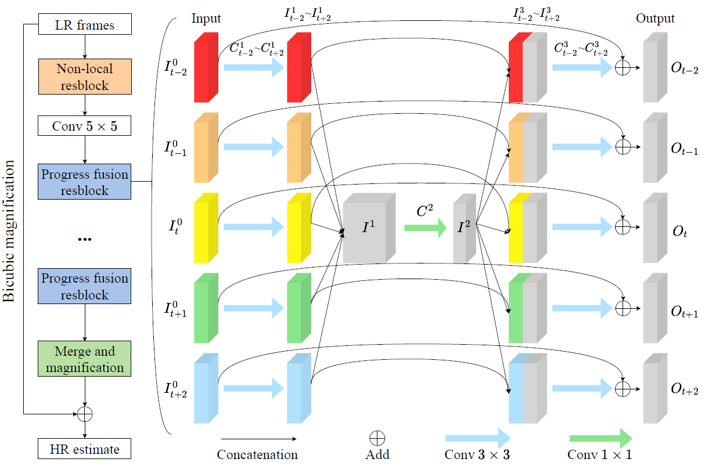

- **ADNLVSR**

  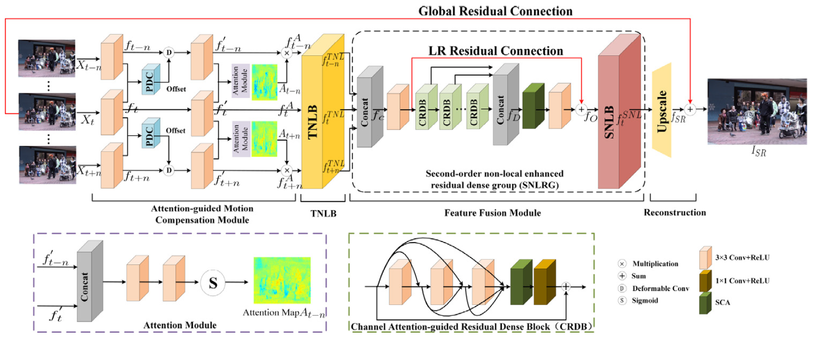

- **EDVR**

  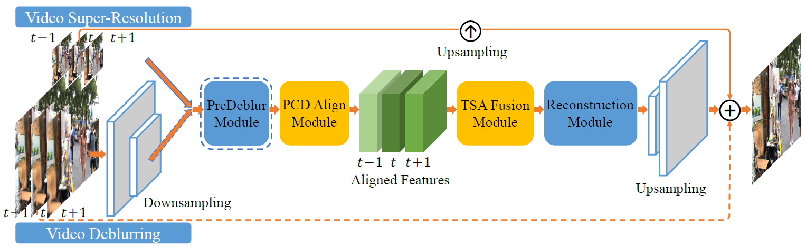

- **VSR-DUF**

  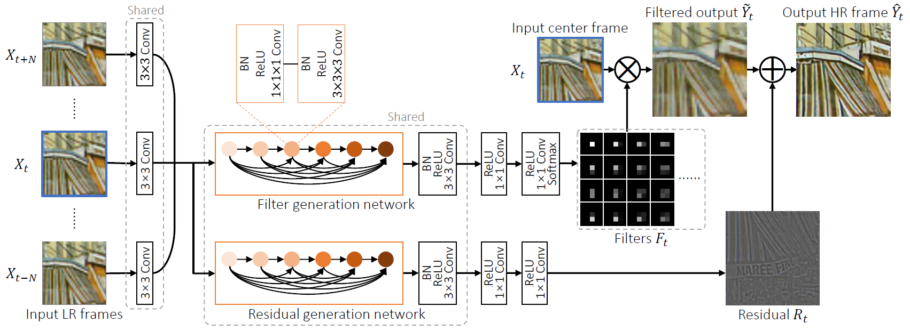

- **RBPN/6-PF**

  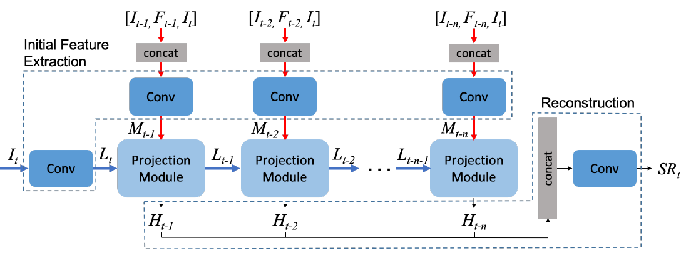

- **TDAN**

  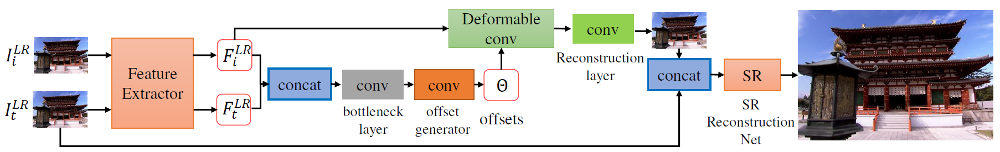

- **FRVSR**

  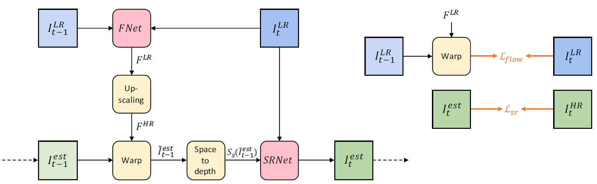

- **WDVR**

  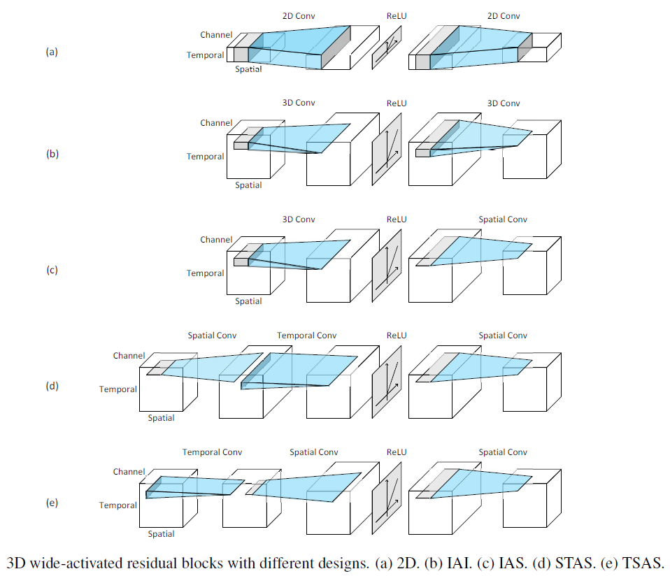

- **MDCN**

  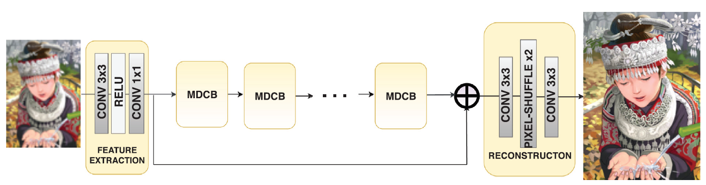

- **DDAN**

  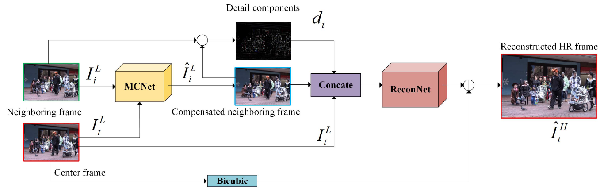

- **SOF-VSR**

  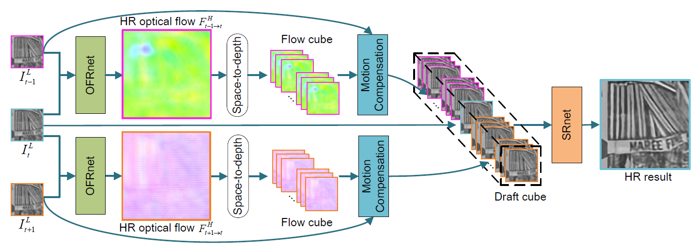

- **DRDVSR**

  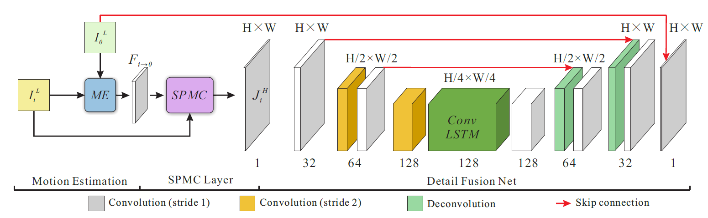

- **VESPCN**

  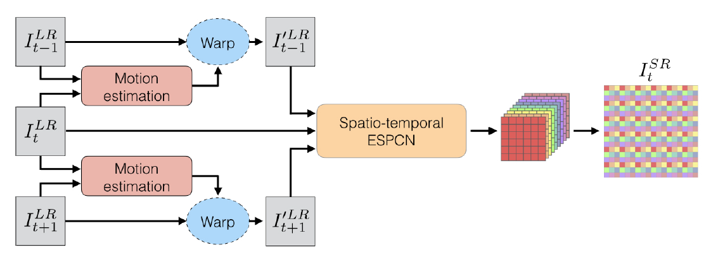

---

## 2) The datasets of VSR

---

Please refer to [Dataset.md][Datasetmdlink] for more details.

[Datasetmdlink]: ./Doc/Dataset.md

---

## Citation

---

- Isobe, Takashi, Fang Zhu, and Shengjin Wang. "Revisiting Temporal Modeling for Video Super-resolution." arXiv preprint arXiv:2008.05765 (2020).
- Chadha, Aman, John Britto, and M. Mani Roja. "iSeeBetter: Spatio-temporal video super-resolution using recurrent generative back-projection networks." Computational Visual Media (2020): 1-12.
- Yi, Peng, et al. "Progressive fusion video super-resolution network via exploiting non-local spatio-temporal correlations." Proceedings of the IEEE International Conference on Computer Vision. 2019.
- Sun, Wei, and Yanning Zhang. "Attention-guided Dual Spatial-Temporal Non-local Network for Video Super-Resolution." Neurocomputing (2020).
- Wang, Xintao, et al. "Edvr: Video restoration with enhanced deformable convolutional networks." Proceedings of the IEEE Conference on Computer Vision and Pattern Recognition Workshops. 2019.
- Jo, Younghyun, et al. "Deep video super-resolution network using dynamic upsampling filters without explicit motion compensation." Proceedings of the IEEE conference on computer vision and pattern recognition. 2018.
- Haris, Muhammad, Gregory Shakhnarovich, and Norimichi Ukita. "Recurrent back-projection network for video super-resolution." Proceedings of the IEEE Conference on Computer Vision and Pattern Recognition. 2019.
- Tian, Yapeng, et al. "TDAN: Temporally-Deformable Alignment Network for Video Super-Resolution." Proceedings of the IEEE/CVF Conference on Computer Vision and Pattern Recognition. 2020.
- Sajjadi, Mehdi SM, Raviteja Vemulapalli, and Matthew Brown. "Frame-recurrent video super-resolution." Proceedings of the IEEE Conference on Computer Vision and Pattern Recognition. 2018.
- Fan, Yuchen, et al. "An Empirical Investigation of Efficient Spatio-Temporal Modeling in Video Restoration." Proceedings of the IEEE Conference on Computer Vision and Pattern Recognition Workshops. 2019.
- Purohit, Kuldeep, Srimanta Mandal, and A. N. Rajagopalan. "Mixed-dense connection networks for image and video super-resolution." Neurocomputing (2019).
- Li, Feng, Huihui Bai, and Yao Zhao. "Learning a Deep Dual Attention Network for Video Super-Resolution." IEEE Transactions on Image Processing 29 (2020): 4474-4488.
- Wang, Longguang, et al. "Deep Video Super-Resolution using HR Optical Flow Estimation." arXiv preprint arXiv:2001.02129 (2020).
- Tao, Xin, et al. "Detail-revealing deep video super-resolution." Proceedings of the IEEE International Conference on Computer Vision. 2017.
- Caballero, Jose, et al. "Real-time video super-resolution with spatio-temporal networks and motion compensation." Proceedings of the IEEE Conference on Computer Vision and Pattern Recognition. 2017.
